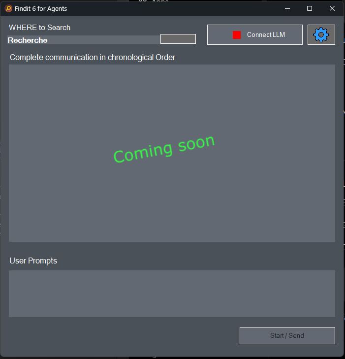

# Findit Agent Frontend

👉 **[Program description and documentation](https://mhoub.github.io/Findit-Agent-Frontend/Findit6Agent_Start.html)**

🚧 **Work in Progress**

This repository is currently under active development.  
Available from early October with complete downloads and source code.

---

## What is Findit Agent?

**Findit Agent brings agentic AI research to your own local document collections.**

It can search for a single fact hidden somewhere in thousands of files, or research information across many documents and turn the findings into an evidence-based report.
The research itself is performed by an AI agent using a wide range of supported LLMs and providers — or, with suitable hardware, completely local models.
Instead of requiring a prepared AI knowledge base, Findit Agent uses **Findit6 as a kind of “grep on steroids”**:

- no indexing required
- no vectorization or embeddings required
- no vector database required
- no preprocessing of the archive
- newly added or changed files are immediately searchable

### The archivist principle

Findit6Agent acts like an **archivist between your files and the AI**.

The AI does not receive direct access to your archive. It asks Findit6Agent to search, receives search results, and can request selected documents, text copies or excerpts for further analysis.
Only the text required for the current research task is passed to an external AI provider.
With a sufficiently powerful computer and a local LLM, even this processing can remain completely local: the archive, searches, extracted text and AI analysis never have to leave your machine.

---

**Freeware Beta / Source-available · Windows only**

Findit Agent Frontend and Findit 6a are available free of charge for private and experimental use. Commercial, professional or business use requires a valid commercial license.

## Why Findit Agent?

Findit6 searches existing local archives directly — without indexing, embeddings, vector databases or preprocessing. New or changed files are immediately available for research.
It works with many common file types, including Office documents, PDFs, emails, archives, source code and OCR-processed documents.
The AI agent can use these search results to:

- find individual facts
- read and compare relevant documents
- identify relationships and patterns
- combine evidence from multiple sources
- produce source-based research reports

Relevant documents or excerpts are converted into machine-readable text only when needed and passed to the AI for analysis.

Every research step remains visible, documented and auditable.

