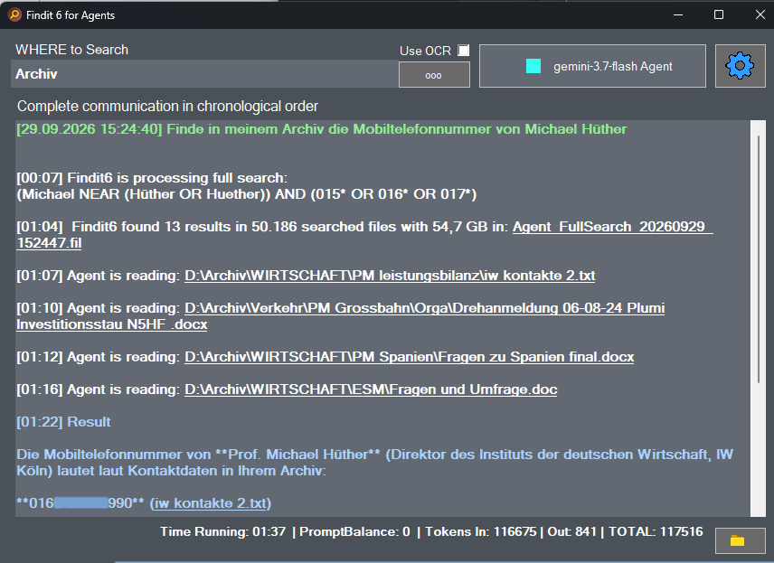

# Findit Agent 

👉 **[Program description and documentation](https://mhoub.github.io/Findit-Agent-Frontend/)**

**Findit Agent brings agentic AI research to your own local document collections.**

It can search for a single fact hidden somewhere in thousands of files, or research information across many documents and turn the findings into an evidence-based report.
The research itself is performed by an AI agent using a wide range of supported LLMs and providers — or, with suitable hardware, completely local models.
Instead of requiring a prepared AI knowledge base, Findit Agent uses **Findit6 as a kind of “grep on steroids”**:

- no indexing required
- no vectorization or embeddings required
- no vector database required
- no preprocessing of the archive
- newly added or changed files are immediately searchable

### The archivist principle

Findit6Agent acts like an **archivist between your files and the AI**.

The AI does not receive direct access to your archive. It asks Findit6Agent to search, receives search results, and can request selected documents, text copies or excerpts for further analysis.
Only the text required for the current research task is passed to an external AI provider.
With a sufficiently powerful computer and a local LLM, even this processing can remain completely local: the archive, searches, extracted text and AI analysis never have to leave your machine.

---

**Freeware Beta / Source-available · Windows only**

Findit Agent Frontend and Findit 6a are available free of charge for private and experimental use. Commercial, professional or business use requires a valid commercial license.

## Download, install, run

👉 **[Download the complete Windows installer](https://github.com/MHoub/Findit-Agent-Frontend/releases/tag/v1.00.01)**

The installer contains all required Findit6Agent components, including the local reranker and its runtime environment. No manual setup is required.
You only need an API key for a supported AI provider — or a working Ollama installation for local use.

## Why Findit Agent?

Findit6 searches existing local archives directly — without indexing, embeddings, vector databases or preprocessing. New or changed files are immediately available for research.
It works with many common file types, including Office documents, PDFs, emails, archives, source code and OCR-processed documents.
The AI agent can use these search results to:

- find individual facts
- read and compare relevant documents
- identify relationships and patterns
- combine evidence from multiple sources
- produce source-based research reports

Relevant documents or excerpts are converted into machine-readable text only when needed and passed to the AI for analysis.

## Fully traceable research

Findit Agent is designed so that its research can be checked step by step.

Every factual statement in the final answer is linked directly to the original source file and can be opened with a single click.

The complete research process is documented:

- every Findit search performed by the agent
- every result list produced by these searches
- every document or excerpt the agent actually read
- the conclusions it drew from that material
- the source files used for the final answer

Searches and result lists can be reopened and inspected by the user at any time. This makes the research process reproducible, transparent and directly verifiable — instead of producing an answer whose origin remains hidden.

Example: a short “needle in the haystack” lookup performed by Gemini Flash. The Agent automatically works in the language used by the user and dominant in the archive. In this case, it found the private mobile number of the director of a major economic research institute in my archive — of course, the number is hidden here.

👉 **[Full documentation and first steps](https://mhoub.github.io/Findit-Agent-Frontend/)**

